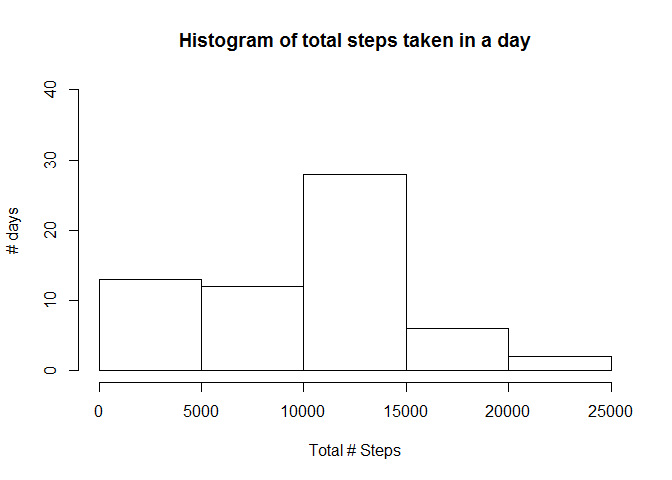
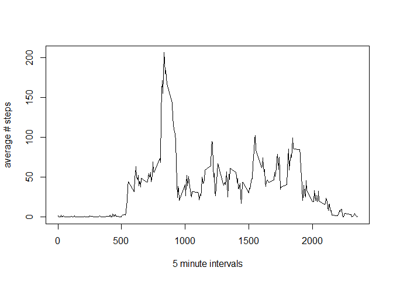
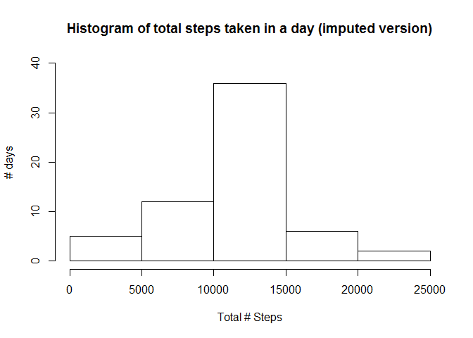
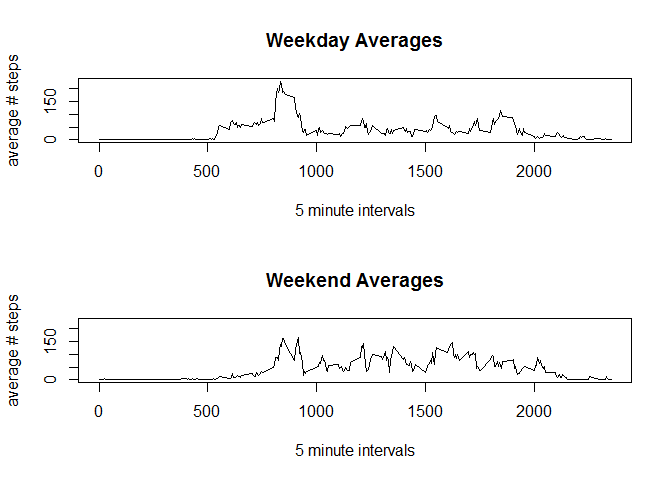

# Reproducible Research: Peer Assessment 1


## Loading and preprocessing the data


```r
library(ggplot2)
library(reshape2)
library(dplyr)
```

```
## Warning: package 'dplyr' was built under R version 3.3.2
```

```
## 
## Attaching package: 'dplyr'
```

```
## The following objects are masked from 'package:stats':
## 
##     filter, lag
```

```
## The following objects are masked from 'package:base':
## 
##     intersect, setdiff, setequal, union
```

```r
mydir <- "F:\\Coursera\\repro_res\\wk2"
setwd(mydir)

mydata <- read.csv("activity.csv", header = TRUE, sep=",")
```

The variables included in this dataset are:
*steps: Number of steps taking in a 5-minute interval (missing values are coded as NA)
*date: The date on which the measurement was taken in YYYY-MM-DD format
*interval: Identifier for the 5-minute interval in which measurement was taken

## What is mean total number of steps taken per day?


```r
mydaysums <- data.frame(tapply(mydata$steps, mydata$date, sum, na.rm=TRUE))
mydates <- unique(mydata$date)
mydaysums <- cbind(mydates, mydaysums)
colnames(mydaysums) <- c("dates", "tot_steps")
```

The following is a histogram displaying the distribution of average steps across all days:

```r
hist(mydaysums$tot_steps, breaks="FD", main = "Histogram of total steps taken in a day", xlab="Total # Steps", ylab="# days", ylim=c(0,40))
```

<!-- -->

The mean and median total number of steps per day are:

```r
mean(mydaysums$tot_steps)
```

```
## [1] 9354.23
```

```r
median(mydaysums$tot_steps)
```

```
## [1] 10395
```

## What is the average daily activity pattern?
A time series plot of the 5-minute interval (x-axis) and the average number of
steps taken, averaged across all days (y-axis) is displayed below:

```r
myintervsavg <- tapply(mydata$steps, mydata$interval, mean, na.rm=TRUE)
plot(myintervsavg ~ unique(mydata$interval), type="l", xlab = "5 minute intervals",
     ylab = "average # steps")
```

<!-- -->

From the average across all days in the dataset, the interval with the maximum average number of steps, as well as the value itself, is:

```r
myintervsavg[which.max(myintervsavg)]
```

```
##      835 
## 206.1698
```

## Imputing missing values
The total number of missing values (rows where steps = NA) in the data set is:

```r
sum(is.na(mydata$steps))
```

```
## [1] 2304
```

An arbitrarily-selected strategy to impute this missing data is to replace all NA 
step rows with the average # of steps for that specific interval based on the existing
data. The following code generates an imputed data set:

```r
myimpdata <- data.frame(mydata)

# these are my rows for "myimpdata" with NA steps
naindices <- which(is.na(mydata$steps), arr.ind = TRUE)
myintervsavgwcols <- data.frame(cbind(unique(mydata$interval),myintervsavg))
colnames(myintervsavgwcols) <- c("intervals", "avgs")

# for loop to replace all NA rows with the mean # steps per corresponding interval
for (i in 1:length(naindices)) {
     # get interval of the row that needs imputation
     mytargetint <- myimpdata[naindices[i],3]
     
     # look at list of averages for intervals, and get the average for that interval
     myimpvalue <- myintervsavgwcols$avgs[myintervsavgwcols$intervals==mytargetint]
     
     # put the average value into the row that needs imputation
     myimpdata$steps[naindices[i]] <- myimpvalue
}
```

The following code generates a new histogram and a new mean and median based on the new
data set (with imputed data, based on the aforementioned strategy):


```r
myimpdaysums <- data.frame(tapply(myimpdata$steps, myimpdata$date, sum, na.rm=TRUE))
myimpdates <- unique(myimpdata$date)
myimpdaysums <- cbind(myimpdates, myimpdaysums)
colnames(myimpdaysums) <- c("dates", "tot_steps")

hist(myimpdaysums$tot_steps, breaks=seq(0,25000,by=5000), main = "Histogram of total steps taken in a day (imputed version)", 
     xlab="Total # Steps", ylab="# days", ylim=c(0,40))
```

<!-- -->

The corresponding mean and median values for this imputed data set are:

```r
mean(myimpdaysums$tot_steps)
```

```
## [1] 10766.19
```

```r
median(myimpdaysums$tot_steps)
```

```
## [1] 10766.19
```

The impact of imputing missing data in this manner is that there is
an increase in the frequency of days around the average # of total steps (as expected).


## Are there differences in activity patterns between weekdays and weekends?

The following code creates a new factor variable in the dataset with two levels -
"weekday" and "weekend", which indicates if a given date is a weekday or weekend day.

```r
mynewdata <- mutate(myimpdata, wkdayorwknd = weekdays(as.Date(mydata$date)))
weekdays1 <- c('Monday', 'Tuesday', 'Wednesday', 'Thursday', 'Friday')

mynewdata$wkdayorwknd <- factor((mynewdata$wkdayorwknd %in% weekdays1),
                                levels=c(FALSE,TRUE), labels=c('weekend', 'weekday'))
```

The following code creates a panel plot (2 rows, 1 column) containing a time series plot of the t-minute
interval (x-axis) and the average number of steps taken, averaged across all weekday
days or weekend days (y-axis):


```r
mywkdaydata <- mynewdata[mynewdata$wkdayorwknd=="weekday",]
mywknddata <- mynewdata[mynewdata$wkdayorwknd=="weekend",]

mywkdayavgs <- tapply(mywkdaydata$steps, mywkdaydata$interval, mean, na.rm=TRUE)

mywkndavgs <- tapply(mywknddata$steps, mywknddata$interval, mean, na.rm=TRUE)

ymaxwkday <- max(mywkdayavgs)
ymaxwknd <- max(mywkndavgs)
ymax <- max(ymaxwkday,ymaxwknd)

par(mfrow=c(2,1))
plot(mywkdayavgs ~ unique(mydata$interval), type="l", xlab = "5 minute intervals",
     ylab = "average # steps", main = "Weekday Averages", ylim=c(0,ymax))

plot(mywkndavgs ~ unique(mydata$interval), type="l", xlab = "5 minute intervals",
     ylab = "average # steps", main = "Weekend Averages", ylim=c(0,ymax))
```

<!-- -->

It appears that generally, on weekdays, earlier in the day, there is a higher average # of steps as compared to the same timeslots on weekends, whereas on weekends, later in the day, there is a higher average # of steps as compared to the same timeslots on weekdays.
